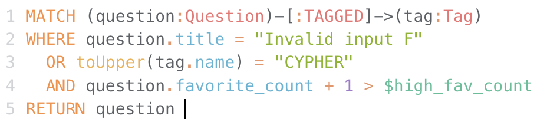
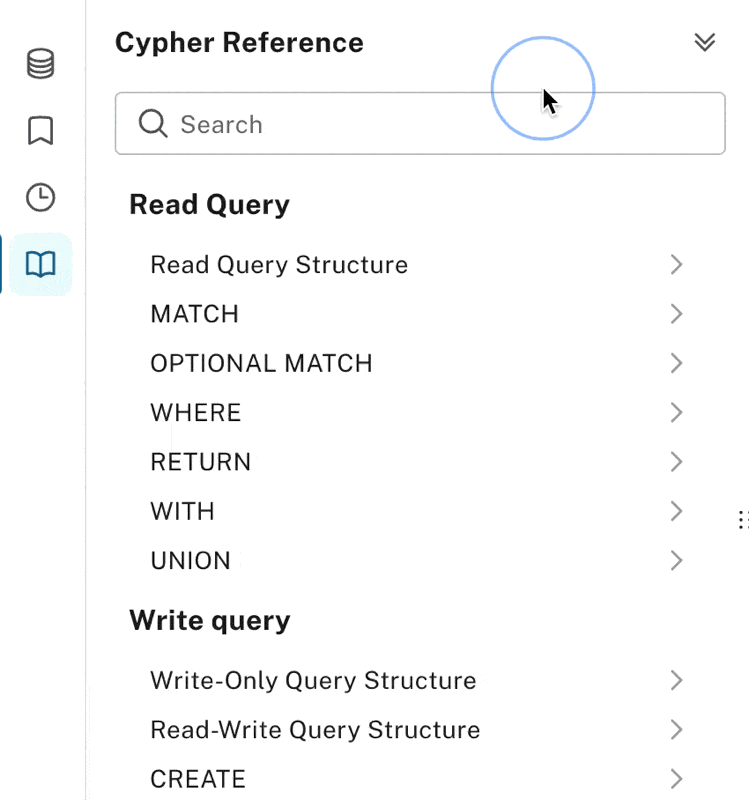

= New Browser Preview
//:images: img/browser-preview
// http://localhost:4000/browser-preview.workspace.json

== Introduction

Welcome to the New Browser Preview! 
Browser's querying functionality has been modernized and integrated into Neo4j Aura, and these benefits are now available in the new Browser, bundled with the Neo4j on-prem distribution.

If you use Neo4j Aura you’ll see the same capabilities as this New Browser Preview offered under the **Query** part of the integrated experience. 
Query and Browser are similar, but Query provides features you might expect from a cloud offering like user content being backed by cloud storage so it’s available wherever you log in. 
For the standalone Browser, content continues to be backed by LocalStorage and therefore tied to the browser you use to access the application.

With that context, read on to learn more about the big new updates in this preview:

- New Cypher editor
- Richer table visualization
- More scalable graph visualization
- New history and quick search
- Improved saved Cypher experience
- Revised parameters 

== New Cypher editor

One of the biggest improvements is the new editor which is now built from the same source as the Cypher language.
The Cypher language is ever-evolving and the new editor helps you stay up-to-date with the latest language features.
Here are a few ways the new editor helps you do that:  
 
Syntax highlighting:: Richer syntax highlighting identifies potential errors from things like property values being misinterpreted as Cypher keywords and differentiates more tokens for ease of reading.

Auto completions:: The underpinnings of the Cypher editor now have an improved understanding of valid constructs, meaning it will, for example, more accurately complete the next valid keyword.

image::cypher-editor-auto-completions.gif[]

Inline help:: When using a procedure or making a function call, helpful descriptions and signatures are presented, allowing you to better understand what’s expected as an input or what might be returned.

image::cypher-editor-inline-help.png[]

Cypher linting:: One of the most useful new features is Cypher linting, which lets you see useful warnings and errors _before_ running a query. 
This helps shorten the feedback loop, so you don’t have to run a query to spot syntactic or semantic errors. 
This is especially useful when editing larger queries or using new language constructs where you might not know what to expect.

image::cypher-editor-linting.png[]

Cypher reference:: As a complement to the in-editor help, a searchable Cypher reference is now available in the sidebar. 
This is useful to check the syntax of a Cypher construct or want a quick reference of which temporal functions exist and how to use them, for example. 
The reference also provides links to the Cypher manual for more in-depth explanations and examples.

== Richer table visualization

The table visualization now employs reactive result fetching by default.
This means that the number of rows returned by a query is automatically limited, regardless of any `LIMIT` statements you apply. 
This is useful for both new and experienced users since an unintentional omission of a `LIMIT` statement can lead to an unexpectedly large amount of results returned, which could previously have overwhelmed Browser.
The table now also employs virtualized rendering meaning that even if you do return a larger number of rows, only those in view are rendered to keep the application more responsive.

There are functional improvements too. 
A new render for paths, relationships, and nodes allows you to more readily discern labels/types and key/value pairs. 
By default, the render is compact, but optionally it allows graph objects to be pretty-printed for situations where readability is more important than compactness.

Simple result filtering is now also available, allowing you to perform simple text matches on returned results. 
It's often simpler and quicker than modifying a Cypher statement to contain a WHERE clause.

image::table-visualization.gif[]

 
== More scalable graph visualization

The graph visualization has been rebuilt using a new engine while maintaining the familiar layout algorithm from the outgoing graph visualization. 
This makes the visualization more responsive and allows for a larger number of nodes and relationships to be visualized.

Another important functional change is that the visualization now only displays items you explicitly return in Cypher statements - it no longer automatically connects returned nodes with relationships that exist between them. 
This can still be achieved on-demand via a context menu in the visualization to “show all relationships”.

image::scalable-graph-visualization.gif[]

== New history and quick search

The familiar and convenient up/down arrow history feature remains but has been supplemented with a dedicated sidebar to review and manage history, allowing history to be selectively deleted or exported.

For convenience, the history available in the sidebar is also searchable via a fuzzy search from the main editor, allowing you to quickly find a query in your history. 
This can be invoked from the […] more menu on the main editor or via Ctrl+R.

image::history-quick-search.gif[]

== Improved saved Cypher experience

The “Favorites” experience from Browser is now “Saved Cypher” and provides a refreshed way of creating and managing Cypher. 
You can now more readily re-order items among nested folders, and Cypher statements saved from the editors recall the last folders used for convenience. 

image::saved-cypher.gif[]

== Revised paramaters 

The parameters implementation has rationalized the `:param` and `:params` variants that differed in Browser. 
While singular and plural versions of the command are respected, they behave the same way and offer support for setting parameters singularly via the arrow syntax `:param a => 1` or multiply via Cypher maps `:param {a:1, b: 2}`. 

== And finally...

We hope you enjpy using the new Browser preview. Please note that the following are not yet supported:

- `:server [connect | disconnect]` commands and frames. For the time being the connection header at the top of the page is used to connect to instances
- `:sysinfo` command to review details of your dbms cluster
- `:play` commands to play builtin and custom guides
- `:server user [add | list]` commands to support user management - this is possible via the cypher surface, see docs for more details.
- GraSS and the `:style` command to set custom styles. Some basic styling support is provided via the UI to change colors, captions and size as well as ordering the priority of styles when multiple labels apply to a node.  

This new Browser preview will ultimately replace the existing Browser as the default and later only experience. If these items or anything else is important to you, please head over to https://feedback.neo4j.com/query and drop your feedback there.