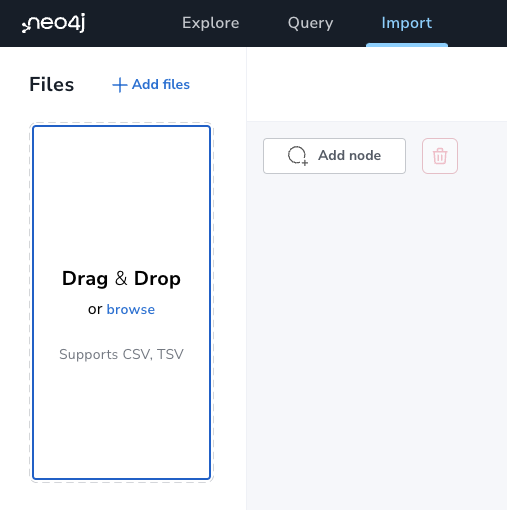

= Learn how to import and map data with Neo4j Data Importer

== Data Importer

This guide will teach you how to import data from flat files and how to map the data to your graph data model.

If you havent't already, please go through the _Getting started with Neo4j_ to learn the basics of Neo4j, including a brief introduction to the _graph property model_ and how this relates to the relational database model.

The _Getting started with Neeo4j_ guide shows you the basics on the topic of importing data, but this guide will go more in-depth and focus solely on Data Importer. 

The topics covered in this guide are:

* Scope of Importer -- a brief introduction to the Importer.
* Provision of files -- File formats, mapping, uploading, and structure of files.
* Your model -- referring to your files, creating nodes, mapping relationships, ID selection and mapping, and complete the mapping.
* Preview your import -- test without loading data, inspect the preview, limitations of the preview, and the difference between preview and run import.
* Run your import -- resolving mapping errors, load progress, and understanding the Cypher load statements.
* Exploring the resulting graph -- using the _Explore_ tab.
* Saving and loading -- your model, mapping, and data.
* Re-running the import -- idempotency and uniqueness constraints.
* What's next? -- when you outgrow Data Importer and other ways to import data.
* FAQ -- common errors, missing files, replacing files, and identically labeled nodes.

== Scope of Importer

This guide assumes that you have a basic understanding of Neo4j and the graph property model. 
If you are new to Neo4j, please go through the _Getting started with Neo4j_ guide first.
Once you're familiar with the basics, you are ready to have a closer look at the file format for importing data and how this relates to your graph model.

=== Flat files

Currently, Data Importer supports the import of data from flat files.
Flat files are files that contain data in a tabular format.
Each row represents a record and each column represents a field.
The most common file formats are CSV (comma-separated values) and TSV (tab-separated values).
Data Importer supports both of these formats, but this guide will focus on CSV.
This guide doesn't teach you how to create CSV files, but gives you a closer look at their structure.

=== Mapping

The flat files contain both the data and the structure of the data.
This means that the files contain both the nodes and the relationships that connect them.
All you need to do is to map the data to the graph model you have in mind.
Data Importer lets you draw your model and then map your data to it.
You'll get to this in a moment.

== Provision of files

The first thing you need to do is to locate the data you want to import.
This can be individual CSV files or a directory containing multiple files.
Once you have the files, drag and drop them into the _Files_ section of the _Import_ tab or click _browse_ to select from a file dialog.
Keep in mind that _uploading_ the files is not the same as _importing_ them. 
You just make them available to the Data Importer, not to your database.

Download the _Northwind_ example dataset by clicking the button below.

//Need to modify the action to only dowload files and NOT a model
button::Download the Northwind dataset[role=NX_IMPORT_LOAD,endpoint=https://neo4j-graph-examples.github.io/get-started/data/northwind-data-importer-model-data.zip]

Once downloaded, drag and drop the files into the _Files_ section, or use the browse option in the same section.
You should now see eleven CSV files in the _Files_ section.

=== File structure

The CSV files may or may not contain a header row.
The header row is the first row of the file and contains the names of the columns and if it is not present, you need to provide this information in a separate file.
Best practice is to always include a header row.
If you have a closer look at the dataset you just downloaded, you can see that the files contain a header row.
These are the first few lines of the `order-details.csv` file:

----
OrderID,ProductID,UnitPrice,Quantity,Discount
10248,11,14,12,0
10248,42,9.8,10,0
10248,72,34.8,5,0
----

This tells you that the file contains five columns and that the first column is called `OrderID`, the second `ProductID`, and so on.
Apart from the header row, it is also important that the nodes in your CSV files have _unique IDs_.
If not, you will have problems when you load the data and try to create relationships to connect the nodes.
To learn more about the format of the CSV files and header rows, head over to the https://neo4j.com/docs/operations-manual/current/tools/neo4j-admin/neo4j-admin-import/#import-tool-header-format[Operations Manual -> CSV header format].

//Action to import files

== Thinking about your model

You should be familiar with the _graph data model_ by now, but in summary, the graph property model shows how your data is connected.
When you create your model, you need to think about the data in your CSV files and how the data is connected.
As mentioned earlier, your CSV files already contain all the informatiom about how the data within the files is connected, you just need to map it to your graph model.

=== Create nodes

The first thing to do is create nodes in your model.
The nodes represent the entities in your data and in case of the Northwind dataset, the nodes represent the customers, products, orders, and so on.
To create a node, click the _Add node_ button.
The nodes in your model need to have a _label_.
Remember, a label is used to group nodes of the same type together.
First, create a node with the label `Order`.
You define the label for the node in the _Mapping Details_ pane, along with what file it should map to and also what properties it should have.
Select `orders.csv` from the _File_ dropdown and then add the properties 

